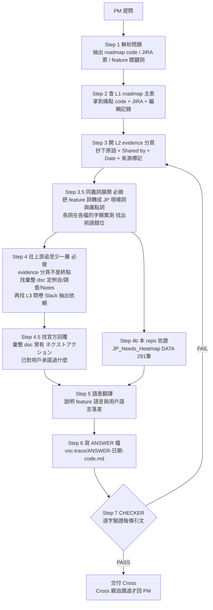

# voc-trace — PM 問題 VOC 溯源 graph

## 目的

PM 常問：「這條 roadmap item 的 VOC 依據是什麼？我找不到用戶原話。」
這個 graph 把「找原話」變成固定流程：**每一個 claim 都要有逐字引文 + 可點開的出處**，
沒有出處的句子不准出現在答案裡。

## 為什麼 PM 通常找不到（三個獨立原因，開工前先讀）

1. **層級**：roadmap 是多層的。L1 主表只有 feature 標題；原話在 L2 evidence 子分頁；
   L2 之上還有一層**彙整 doc**（例：プロライバー定例会調查 doc），真正的原始問卷/Slack 在 L3。
   PM 通常只看 L1。
2. **語言落差**：feature 語言 ≠ 用戶語言。用戶說的是痛（「手計算になる」「選べない」），
   不是功能名。用 feature 詞搜 L3 一定零命中。
3. **術語錯位（最陰險，實際踩過）**：同一個東西，JP 現場 / 產品 / roadmap / JIRA 可能用**不同的詞**，
   而且可能是抄寫時走鐘的近似詞。實例：JP 端用「**小袋**」（與「**親袋**」成對），
   roadmap 與 JIRA 票寫成「**子袋**」→ 用票上的詞搜 JP 文件永遠 0 筆。
   **所以 Step 3.5 的同義詞展開是強制步驟，不是選配。**

## Graph



## 搜尋軸（四軸都要想過，不要只用關鍵詞）

| 軸 | 怎麼用 | 為什麼 |
|---|---|---|
| **內容** | `fullText contains '<痛點語言>'` | 預設軸，但只有這軸會漏掉術語錯位 |
| **人** | `owner = 'mayu@17.media'`（VOC DB 管家）、`ryoyamamoto@`、`cecilia@`（定例会）、`evanwu@`（research）、`ayana.y@`（STT）、`katsu.n@`、`summerchiang@`（SVIP）| VOC 資產分散在多人名下；按人撈比按詞撈穩 |
| **時間** | `modifiedTime > '<近30天>'`、`list_recent_files` | 找「最近有沒有新證據」，關鍵詞搜不出來 |
| **容器** | `parentId = '<folder>'`；表單 → Responses 兄弟檔 | 逐筆原始回答只能這樣拿到 |

## 資料源註冊表（搜尋順序照此）

**先讀這個**：`VOCデータベース管理` Sheet `1QRN6sJL0I_Nwgf-oik2hD_H6Dx3UU12IDgLI8KZfN5o`（owner mayu@）
— 分頁「現状のVOC流入動線」列出全部 22 條 VOC 進件管道（工具／URL／對象／負責部門／窗口人／原始資料表連結），
分頁「分類時項目」是官方分類法。**它是 source-of-sources，開搜前先看它，比亂搜快。**

| # | 層 | 來源 | ID / 位置 | 備註 |
|---|---|---|---|---|
| 1 | L1+L2 | Japan VoC roadmap workbook_HQJP共有 | Sheet `16AuZeGSu2z1PwnTvhZI2HazyG16zltOs7eRxEC04rcE`（L1 gid `1005872232`）| L2 分頁標題格式 `Sx.y · <pain title>` |
| 2 | **L2 彙整** | **プロライバー定例会機能関連リクエスト調査** | Doc `14VmxFzGiofl-EQGyo53mh2RohskSzGYlAOsGk3RHg8s`（cecilia@）| 按月分段（4/30、5/28、6/27、7/28…），每案四段：ご意見／現在の仕様／関連VOC／**ネクストアクション（官方回覆）**。最高價值的中間層 |
| 2b | L2 彙整 | 【プロライバー定例会】イベントやプロダクトに関するご意見 | Sheet `1PuAyLajodOwx82fVwcq9V-5ynSbEgFdPUwNMyG70E3g`（公開範囲限定）／另有 `1QDZ7FERDK1c4kSyH9_rvaKtN31FmvWHVp2tXga7tgzQ` | 有官方「回答」欄 |
| 2c | L2 彙整 | Notes - Katsu/Mayu/Gary/Ryo - VIPリクエスト仕様詳細相談 | Doc `1ohOSO80wmekucdHnc2HnUDNPScYwCyPJY7sO3NMODPE`（ryoyamamoto@）| 週會筆記，含現行規格決定與用詞（親袋/小袋）|
| 3 | L3 原始 | VIP Feedback Sharing Sheet | Sheet `12pH74KmMPFKrVWj7rLGyj3WDwDGTZmxQY4QdEe3kj4A` | voc-bot 的寫入目標 |
| 4 | L3 原始 | 2026/07/09_VOC抽出依頼 | Sheet `1Z1MVYDwAnbsKZgWw8m3uDG_engE0z8SeNWusp8s2tyk`（My Event 相關 gid `1038434937`）| 定例会 7/28 引用的關聯 VOC |
| 4b | L3 原始 | VOC抽出依頼（ギフトエフェクト、ラッキー）| Sheet `1y0aGN6MqO4LiydqBOj26omOCqaJMqmRgffHTU4QelWo`（mayu@）| 另一批（ticker / lucky）|
| 5 | L3 原始 | ラッキー袋に関するVOC | Sheet `1do7wt9fb1QqXKA26UGqcBvBaJYSdWFIcKg2pJqbqU24`（mayu@）| schema 最乾淨的範本：`created_date/openID/userID/category/topic/sub_topic/tag/summary/raw_text/source` |
| 6 | L3 原始 | [VOC] Frequent crashes while live | Sheet `18xAQrY4zFi8FnwiNCjszGzxKEHaFzoQtmN4Hcxqel_k` | 單一痛點 evidence dossier 的範本，含 `channel` 欄 |
| 7 | L3 原始 | 問卷 → **Responses 兄弟檔** | 例：Form `1XYzX1oLGWcRi7GgLMaxPSq9DEkPv6-C6I-YxR-K7v4w` → Sheet `1vA49oilH09CIGdNeDyu8MsvUEYl6-N_lRW0dKdfxy7g` | **表單本體讀不到，逐筆回答在 Responses 兄弟檔**（見陷阱 §C）|
| 8 | L3 原始 | #jp-user_feedback まとめ | Sheet `1zlck3SzMq7nHzLiv6qJ7J-bLxTNAWF0erkjQgMaBWjs`（ryoyamamoto@）| Slack 撈不到時的替代品（見陷阱 §D）|
| 9 | L3 原始 | SVIP VOC Triage & Classification | Sheet `1Wjf7Spwcr1kbBD0VsEJTSOq29LfPqyioEzsyuz_SHJw`（summerchiang@）| 最高 ARPPU 段 |
| 10 | L3 原始 | JP feedback for Cross（**不可直接給 PM**）| Sheet `1gZoZVwV8FaC2KQyZyiz5eqzXwnuaEbk1DhpEXihqS4k` | 檔名即註明不對 PM 公開，引用前先過濾 |
| 11 | 機器 | STT VOC 候補（ayana.y@）| `11ivRruXPFwpz7OOx9Y5pcXoUoNb-1CRNDSISJ3N7L4o` 等 | 主播語音逐字挖出的候補，精度需人工複核 |
| 12 | 二次 | Confluence《My event research reports》| page `2925395973`（space `17livedesign`）| n=1,388 問卷量化報告；**只有百分比，沒有逐字**，圖表讀不到 |
| 13 | 票 | Jira APPIDEAS（project id 10172, JPD）| `searchJiraIssuesUsingJql` 可用 | 票上多半沒掛 VOC；PM 從票往下追會斷 |
| 14 | 佐證 | 本 repo dashboard 內嵌 DATA（291 筆）| `JP_Needs_Heatmap_JP.html` 的 `const DATA=[...]` | 258 筆有 `dja` 日文逐字、129 筆同時有具名+日期。**凍結快照，非即時** |
| 15 | 索引 | Google Calendar 主日曆 | 「VOC Roadmap Tracking」隔週一 12:00 TPE 等 | 會議是 **Google Meet**，過去場次的 event 上直接掛 Recording + Notes by Gemini + notes doc |

新資料源出現時：加一列（這張表就是 graph 的 state 之一）。

## 已知陷阱（都實際踩過或實測確認）

**§A evidence 分頁不是終點。** v1 答案只讀到 roadmap L2 就收手，結果漏掉了真正的彙整層
（定例会 doc）、官方回覆、以及術語錯位。**Step 4 往上游追一層是強制的。**

**§B `read_file_content` 的 token 上限會截斷，而且 fullText 索引比 reader 撈得更深。**
大檔會 spill 到本機檔案，**spill 本身也可能被截斷**；分頁名不會出現在輸出裡。
後果：某句話「讀不到」不等於「不存在」。
**正確做法**：先用 `fullText contains '<整句>'` 確認哪個檔有這句，再去讀 / 或請人開該分頁。
反例：`あとからでてくるギフトが集計されない…` 在 reader 撈到的內容裡看不到，但 fullText 搜得到。

**§C Google Form 本體讀不到。** 表單物件是死路；逐筆回答在同 parent 的
`<表單名> (Responses)` 兄弟 Sheet。用 `parentId` 或表單名 + `(Responses)` 找。

**§D Slack `#UserFeedback` (C06PRMJ6HRD) 撈不到 —— 這是組織問題不是技術問題。**
Slack 連線的身分是 mikai-inc workspace（`U0A5JJ3LHDF`），不是 17media workspace；
`slack_read_channel` 回硬錯誤 `channel_not_found`，channel 搜尋 0 筆。實測確認，不要重試。
**替代**：註冊表 #8 的 Drive 彙整檔；或請 17media workspace 管理員授權 17LIVE-scoped 連線。
**副作用**：voc-bot 若在跑，Slack 那段會被跳過、判定降級成「規則式(精度低)」。

**§E 引文出處要指到「層」**，不要只寫檔名。同一句話會同時存在於 L3 原始、L2 彙整、
L2 evidence 三個地方；答案要說清楚**哪一層是原生的、哪一層是轉錄的**，因為錯字/走鐘就發生在轉錄。

**§F 撈不到 ≠ 不存在。** 宣告「查無此 VOC」之前，必須先跑一個**已知會命中的對照查詢**
證明搜尋管道本身是活的（negative control）。

## 引文契約（每條 STOP 條件都機械可驗）

答案檔交付前，checker（獨立步驟，不得由寫答案那一輪自評帶過）逐條確認：

1. 每條引文能在註冊表指到的原始檔案裡**逐字 grep 到**（允許空白/換行差異）。
2. 每條引文附：檔名 + file ID（或 repo 路徑 + record id）+ 分頁/列 + **屬於哪一層**。
3. 有 Shared by / Date 欄的來源，引文必附這兩欄。
4. 找不到原話時，答案必須明說「在已註冊資料源中找不到原話」，列出搜過的源與關鍵詞，
   並附 negative control 結果（§F）。**禁止腦補引文。**
5. 答案存檔為 `voc-trace/ANSWER-<YYYY-MM-DD>-<code>.md` 並 commit（跨執行 state：
   已答過的問題不重做，下次引用舊檔再增量）。
6. **同一份 ANSWER 被修正時，必須留「修正記錄」段**，寫清楚 v1 錯在哪、成因是什麼。
   Cross 可能已經根據 v1 回過 PM。

## Loop 判定（loop-contract Step 0 結論，寫死在此避免每次重議）

- Q1「每個輸出 Cross 都會親自讀過才用嗎？」→ **是**（回 PM 前必讀）→ **停在 prompt 層，不建無人 loop**。
- 無人化的部分另有 `voc-bot/`（GAS 每日 08:00 JST）。voc-trace 消費它的產出，不重複建排程。
  ⚠️ voc-bot 是否真的在跑，需看目標表是否有 `VoC_*` 分頁在長；**Code.gs 裡的 Slack token 是 placeholder，
  且 §D 的身分問題未解 → 即使部署了，Slack 那段也是跳過的。**

```
┌─ LOOP CONTRACT ────────────────────────────────
│ NAME   : voc-trace（按需 graph，非排程 loop）
│ TRIGGER: Cross 貼上 PM 提問（人工喚醒，每題跑一次）
│ GOAL   : ANSWER 檔存在於 voc-trace/，其中每條引文
│          通過引文契約 1–6，且已 commit
│ STOP   : PASS = 引文契約 1∧2∧3∧5∧6（找不到時 4 成立亦算 PASS）
│          由 checker 驗證，不得自評
│ BUDGET : 每題最多 3 輪搜尋迭代 / 20 分鐘 / 10 個資料源
│          觸頂 → 交付「目前找到什麼 + 哪些源沒搜完」
│ FAIL   : Drive 暫時性錯誤 → retry+backoff；
│          權限不足 → 停，列出缺權限的檔案請 Cross 開
│          同一源連續 3 次失敗 → 跳過並在答案中註明
└────────────────────────────────────────────────
```

## 語言規則

- 對 Cross：繁中。引文保留原文（日文原話不翻譯，可另附繁中大意）。
- 回 PM 的草稿：依 PM 慣用語言（通常繁中），引文仍保留日文原話。
- **個資**：openID / email / profile URL 不寫進 ANSWER 檔，只寫「該列有」，需要時現查。
