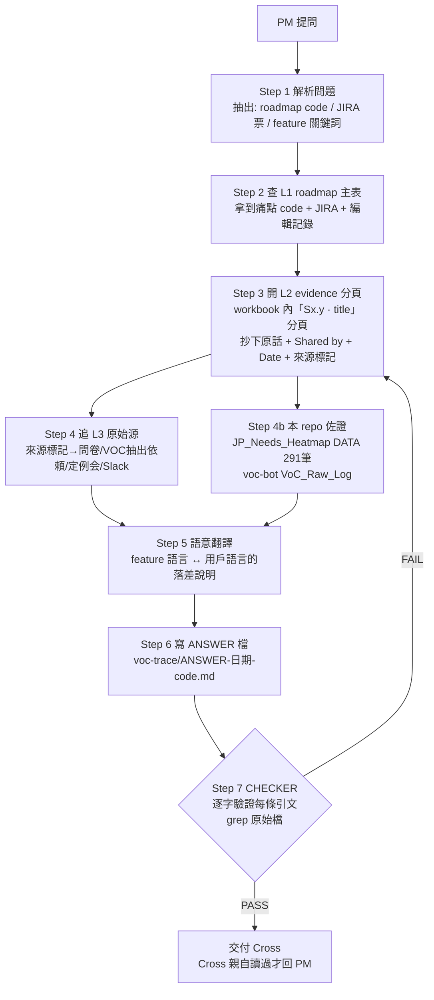

# voc-trace — PM 問題 VOC 溯源 graph

## 目的

PM 常問：「這條 roadmap item 的 VOC 依據是什麼？我找不到用戶原話。」
這個 graph 把「找原話」變成固定流程：**每一個 claim 都要有逐字引文 + 可點開的出處**，
沒有出處的句子不准出現在答案裡。

## 為什麼 PM 通常找不到（先讀這個再開始搜）

1. **Roadmap 是三層結構**：layer-1 主表只有 feature 標題；原話在 layer-2 evidence 子分頁；
   最原始的問卷/Slack/會議記錄是 layer-3。PM 通常只看 layer-1。
2. **Feature 語言 ≠ 用戶語言**：票上的詞（如「子袋」）是內部用語，用戶說的是痛
   （「手計算になる」「選べない」）。用 feature 詞搜 layer-3 一定搜不到——
   要先在 layer-2 找到痛點語言，再拿痛點語言去搜 layer-3。

## Graph



## 資料源註冊表（搜尋順序照此）

| # | 層 | 來源 | ID / 位置 | 怎麼搜 |
|---|---|---|---|---|
| 1 | L1+L2 | Japan VoC roadmap workbook_HQJP共有 | Sheet `16AuZeGSu2z1PwnTvhZI2HazyG16zltOs7eRxEC04rcE`（L1 gid `1005872232`）| Drive `read_file_content` 後在匯出文字裡找 code；L2 分頁標題格式 `Sx.y · <pain title>` |
| 2 | L3 | VIP Feedback Sharing Sheet（含 voc-bot 的 VoC_Raw_Log / VoC_Pain_Points）| Sheet `12pH74KmMPFKrVWj7rLGyj3WDwDGTZmxQY4QdEe3kj4A` | 痛點語言關鍵詞 |
| 3 | L3 | JP feature requests Q3 | Sheet `1la1-k4pBxtWs-ol_4QsYg92cpDeMgrcsVKE5hcjipmY` | 同上 |
| 4 | L3 | JP feedback for Cross | Sheet `1gZoZVwV8FaC2KQyZyiz5eqzXwnuaEbk1DhpEXihqS4k` | 同上 |
| 5 | L3 | プロライバー定例会（調査 doc）| Doc `14VmxFzGiofl-EQGyo53mh2RohskSzGYlAOsGk3RHg8s` + Sheet `1QDZ7FERDK1c4kSyH9_rvaKtN31FmvWHVp2tXga7tgzQ` | 同上 |
| 6 | L3 | VOC抽出依頼（ギフトエフェクト、ラッキー）| Sheet `1y0aGN6MqO4LiydqBOj26omOCqaJMqmRgffHTU4QelWo` | evidence 分頁的來源標記會指到這 |
| 7 | L3 | My Event 問卷 | Form `1XYzX1oLGWcRi7GgLMaxPSq9DEkPv6-C6I-YxR-K7v4w`；Research plan Doc `1ZJ9bBQdSfwx7Fgwf97haEhAWSx3V5koOnznSXk-I9KQ` | 「2026/7/12_アンケート結果」標記 → 這裡 |
| 8 | 佐證 | 本 repo dashboard 內嵌 DATA（291 筆，含 provenance 欄）| `JP_Needs_Heatmap_JP.html` 的 `const DATA=[...]` | python 抽 JSON 後關鍵詞過濾（別手改 HTML）|
| 9 | 補充 | Slack `#UserFeedback` | channel `C06PRMJ6HRD` | Slack search MCP；引文帶 permalink |
| 10 | 補充 | Drive 全域 | — | `search_files` fullText 用**用戶語言**關鍵詞 |

新資料源出現時：加一列到這張表（這張表就是 graph 的 state 之一）。

## 引文契約（每條 STOP 條件都機械可驗）

答案檔交付前，checker（另開驗證步驟，不得由寫答案的同一輪自評帶過）逐條確認：

1. 每條引文能在註冊表指到的原始檔案裡**逐字 grep 到**（允許空白/換行差異）。
2. 每條引文附：檔名 + file ID（或 repo 路徑 + record id）+ 分頁/列（能定位到列就寫列）。
3. 有 Shared by / Date 欄的來源，引文必附這兩欄。
4. 找不到原話時，答案必須明說「在已註冊資料源中找不到原話」，並列出已搜過的源與關鍵詞。**禁止腦補引文。**
5. 答案存檔為 `voc-trace/ANSWER-<YYYY-MM-DD>-<code>.md` 並 commit（這是跨執行的 state：已答過的問題不重做，下次直接引用舊檔再增量）。

## Loop 判定（loop-contract Step 0 結論，寫死在此避免每次重議）

- Q1「每個輸出 Cross 都會親自讀過才用嗎？」→ **是**（回 PM 前必讀）→ **本任務停在 prompt 層，不建無人 loop**。
- 無人化的部分已存在：`voc-bot/`（GAS 每日 08:00 JST 掃 Slack + 4 表單、比對 roadmap、寫 5 個分頁）。
  voc-trace 消費它的產出（VoC_Raw_Log），不重複建排程。

```
┌─ LOOP CONTRACT ────────────────────────────────
│ NAME   : voc-trace（按需 graph，非排程 loop）
│ TRIGGER: Cross 貼上 PM 提問（人工喚醒，每題跑一次）
│ GOAL   : ANSWER 檔存在於 voc-trace/，其中每條引文
│          通過引文契約 1–5，且已 commit
│ STOP   : PASS = 引文契約 1∧2∧3∧5（找不到時 4 成立亦算 PASS）
│          由 checker 驗證，不得自評
│ BUDGET : 每題最多 3 輪搜尋迭代 / 20 分鐘 / 10 個資料源
│          觸頂 → 交付「目前找到什麼 + 哪些源沒搜完」
│ FAIL   : Drive/Slack 暫時性錯誤 → retry+backoff；
│          權限不足 → 停，列出缺權限的檔案請 Cross 開
│          同一源連續 3 次失敗 → 跳過並在答案中註明
└────────────────────────────────────────────────
```

## 語言規則

- 對 Cross：繁中。引文保留原文（日文原話不翻譯，可另附繁中大意）。
- 回 PM 的草稿：依 PM 慣用語言（通常繁中或英文），引文仍保留日文原話。
